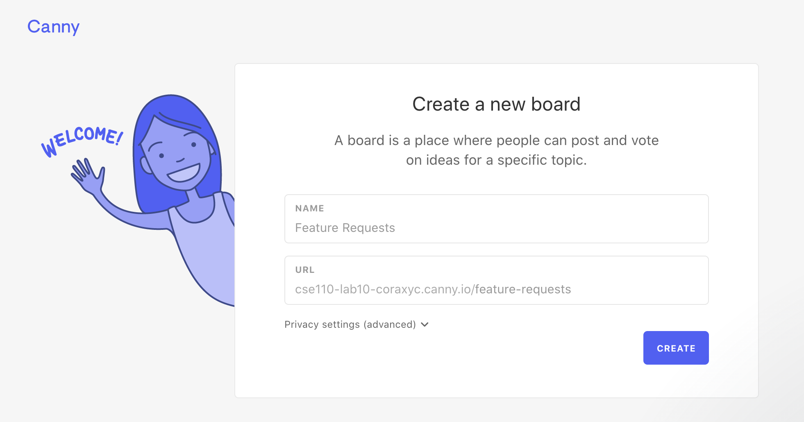
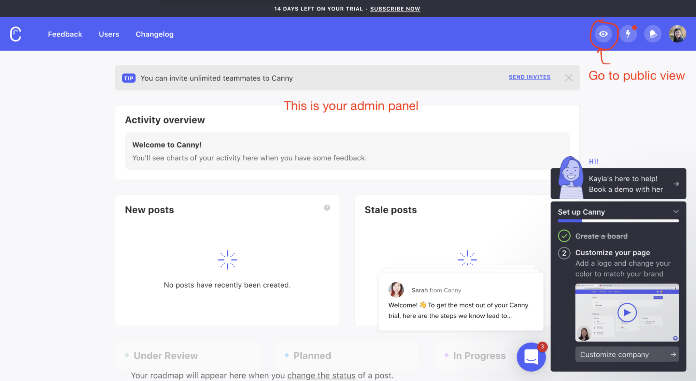
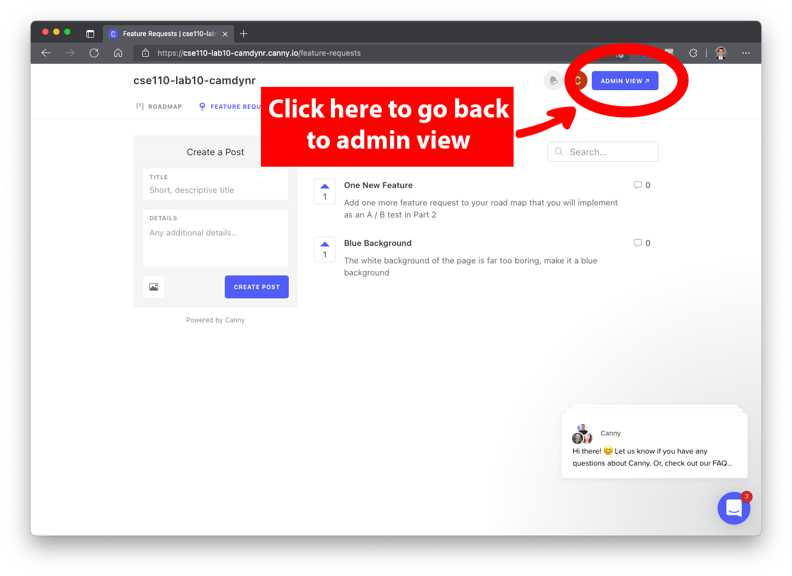
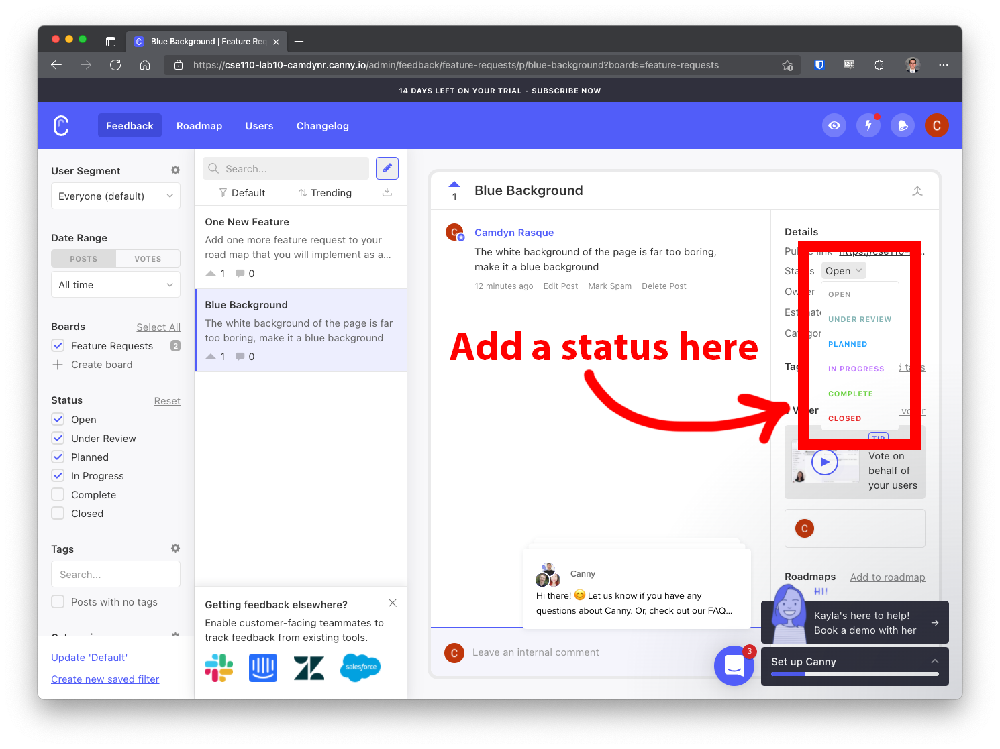
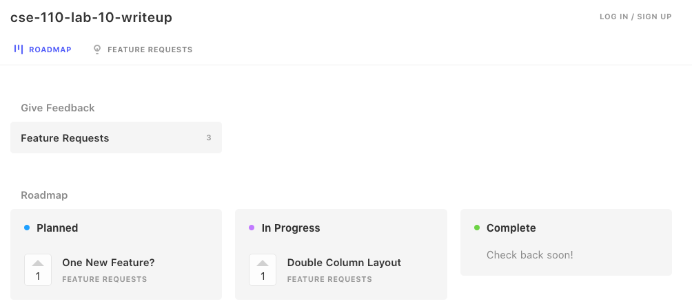

# Lab Week 10 - Post Launch Tooling: User Analytics and Feedback

NOTE:  This lab is optional, you do **not** have to complete this lab. If you do not complete this lab, the lowest of the first **9** labs you completed will still be dropped. Only one lab will be dropped though, so if you **do** complete this lab and this lab is your new lowest lab grade, this lab will be dropped and none of your others will. This lab will be graded as normal, but provides an opportunity to bring up your lab grade if needed.

 

### Intro

In your previous university courses you have likely practiced what the Professor has referred to as “Hand Grenade” coding--a style of coding where you work on a project up until the deadline when you hand it off to be graded and to never think about again. This type of development can harbor some bad habits and is unrealistic in professional software development. Often you are stuck with a codebase for years at a time, so any sloppiness / spaghetti code introduced early on only compounds. 

 

In this lab we’ll explore working on a project that has just “launched” and what steps come next. We’ll start by planning the next steps for the project using two methods: The first is with a Roadmap that we’ll add entries to, and the second is a Feature Request board that we’ll allow users to add requests and ideas to (which we’ll then selectively add to our Roadmap). Before we fully implement these ideas, we have to test them to gauge a response, which is why our next step will be to use Feature Flags to A/B test some new features to collect data. Finally, we’ll set up some standard analytics for our project to see how well it’s doing.

## Setup

 

Download starter code here - https://github.com/CSE110-FA22/Lab10_Starter

 

You may modify any of the included files to your heart’s content.

## Expose - (8 points)
### Part 1 - Roadmap & Feature Request

   

Once you’ve downloaded and set up the starter code, you’re going to head over to https://canny.io/ to create a free account for their services. For your company/app name, fill this text field out using the following format: **`cse110-lab10-<your-github-username-here>`**. Once you’ve created an account, create a Feature Request board for this lab.

This is what your board creation page should look like. Use the default name “Feature Requests” for your board.

Once you’ve made your board (if you're on a different menu don't worry), Click on the eye icon to navigate to the public view, so that you can create posts to your board.

Your public view should look like this:
  

On the public view, click on the “Feature Requests” button to get to your Feature Requests board. On the board, add the following things:

* One post that is titled “Blue Background” with the body “The white background of the page is far too boring, make it a blue background”
* For your second post, come up with a second new feature that you'd like to implement **for the speechSynth** page, you will be A / B testing both of these posts in the next part. This should be a simple feature that's easy to implement.

Let’s add statuses to the posts to indicate to users that we’re working on their feature requests! Mark the status of the “Blue Background” post as “In Progress”. To add a status to your post, first navigate back to the admin view:

Once you’re back on the admin view, you can toggle the statuses of your posts on the Details side menu as shown below:

Your roadmap so far should look like this:

* Finally, log out of your admin account, and then add 3-5 more features that you could implement for this lab
    * When it asks you to make an account for the non-admin post, feel free to make a fake one with fake data and a junk email, not important
* Add the link to this canny.io page in your README

### Part 2 - Feature Flags

What is a feature flag? 

[ALM Rangers - Software Development with Feature Toggles](https://learn.microsoft.com/en-us/archive/msdn-magazine/2014/may/alm-rangers-software-development-with-feature-toggles)

For this section we will be using feature flags to run some A / B tests in our lab. To do so, we’ll first need to create an account with [LaunchDarkly](https://launchdarkly.com/) Links to an external site.and click "Connect" on **Connect LaunchDarkly to your app**

Once you're in the "Connect" menu:

* The first feature flag we'll make will be for a blue-background (the CSS for this has been provided for you, simply add the "blue" class to the body element)
    * In your LaunchDarkly dashboard:
        * First double check that the top left of your screen says "UCSD Production". If it doesn't, swap to it by clicking on that menu.
        * **Create** a new feature flag, title it **blue-background**
            * Under "Select your language" scroll down to **JavaScript** under **Client-Side SDK**
            * Make sure that **Production** is selected for your environment
            * Copy that **script** tag from **part b** and place it at the bottom of your **head** tag in your **index.html** file
            * Copy that **script** tag from **part c** and place it at the bottom of your **body** tag in your **index.html** file
            * Load up your webpage in your browser using liveserver and disable any adblocker you're using
            * Wait until the tutorial says **Great - we received an event for your flag!** to continue
        * Navigate to **Feature Flags** on the left, select **blue-background**, set it to serve **a percentage rollout**
            * The rule should be 50% **true**, 50% **false**
        * Save your changes, turn **Targeting** toggle to on
    * On the client side:
        * Go to the script you pasted in the **body** of your index page
        * Delete every property **except key** from the user variable
        * Delete the following lines
            * every line using the **div** variable (there should be 4)
            * the line where the **label** variable is created
        * Add the following code:
            * Generate a unique random string every page load for the key. No restrictions on how long / what it needs to contain, so long as it's different and new every time you refresh the page. Use this key as the **key** for your user
            * Inside **render()**, when **shouldShow** is true, you should add the class **"blue"** to the **body** element
    * When you open index.html with a liveserver and hit refresh several times, you should be getting a blue background 50% of the time and a white background 50% of the time as shown below

 

* For the second feature flag
    * Make sure that these steps are being followed on the **speechSynth.html** page
    * You can follow the same steps to create this one as the first feature flag, just make sure that in your code **shouldShow** uses the name of your new **feature flag** instead of **blue-background**
    * Take one of the suggestions you thought of earlier from your Roadmap & Feature Request and implement it as an A / B test
    * You will have to code your new feature so that when you refresh the page it shows your new feature 50% of the time, so try to pick something simple.
    * In your README, explain what the difference should be for this A / B test
 
Host this website on GitHub pages and then add links to both **index.html** and **speechSynth.html** on this GitHub pages site to your README so that we can ping your websites and test out the A / B testing

## Explore - (2 points)
### Part 3 - Google Analytics

Now that we've set up our users to receive 2 different versions of the website, we need to collect this data so we can analyze which version performs better.  For this section we're only going to concern ourselves with the blue / white background version of the **index.html** page.

First things first, create a **Google Analytics** account. If it gives you a choice, select **Google Analytics 4**, NOT Universal Analytics. At some point, you should get to this screen, select **Web**

* Next it will ask you to "Set up your web stream". To do this, publish your website to github pages and input that as your Website URL

* make sure to add the code for gtag.js as instructed

* One that is complete, follow the link they provide to create a **Google Tag Manager** account. Your **Google Analytics** account simply shows data it collects in a nice dashboard, **Google Tag Manager** is how you'll set up specific triggers to collect custom data.
* Go over to the **triggers** tab on the left of **Google Tag Manager**, and create a new **trigger**. We're going to create a trigger that waits 30 seconds to fire after the user has loaded the page, as if they like the background they will choose to stay on the page.
* For your trigger, select the following
    * Timer
    * 30000 ms (30 seconds) interval
    * Limit of 1 (you don't want it firing every 30 seconds, just once)
    * Under "Enable this trigger when all of these conditions are true" you will need to select **new variable**
* For this new variable, we want the variable type to be a **DOM Element** since we are selecting the **body** element to see if it has the **blue** class
    * For the Selection Method, we should pick the **CSS Selector**
    * And then simply just **body** for Element Selector since there's only one **body** element
    * And since we are checking it's classes, the **class** attribute name
    * Go ahead and make sure it's all lowercase too, see below

* After that, save it. Select the **variable you just made** from the first drop down (we named ours **Body with class**). Then we want to see if the **class contains** the word **blue**
Finally, your Trigger should look like the one below (you won't see **References to this Trigger** as that's the next step)

* Name this Trigger **wait 30s - blue**
* Repeat this **exact same process** again except instead of **Body with class contains blue** do **Body with class does not contain blue**. Name this trigger wait **30s - white**
* Head over to the **tags** tab on the left side, and create a new **tag**
    * Select **Google Analytics - GA4 Event** as the tag type
    * Choose to manually set the ID from the drop down
        * Go to your code you pasted in for Google Analytics earlier. You should see a line of code that looks like **gtag('config', 'G-123456789);** copy that number that starts with **G-** and paste it in the **Measurement ID** input
    * Name this event **Wait 30s blue tag**
    * For the trigger, select the **wait 30s - blue** trigger we made earlier
* Repeat this exact same process for a **Wait 30s white tag** version

Once you've finished your tags, in the top right of this screen select **Preview**

* Wait 30s on your pages a few times, refreshing to get samples of both white and blue backgrounds
* You should see results like this (ignore the names here the **Wait 30s tag** name should have blue in it):

* If everything looks good, exit out of the **Preview** menu and hit **Publish**

* Once you've published, head back over to **Google Analytics**, and go to the **realtime** tab. Take a **screenshot** of your events on this page showing that your events are working
    * You'll have to load your live site a few times and sit on the pages to feed it some data

For the Google Analytics section, your turn in is a screenshot of the **Google Analytics** showing your two tags working. Call it **google-analytics.png**, place it in a **/screenshots** folder

 

## Turn In:

* GitHub Repo Link
    * README containing 
        * Link to Roadmap & Feature Requests page
        * Links to two A / B test pages from Part 2
        * Explanation of your custom A / B for the **speechSynth.html** page
        * Your and your partner's names
    * Screenshot from Part 3 in a **/screenshot** folder
    * All of the starter code files (including ones that you modified and didn’t)
