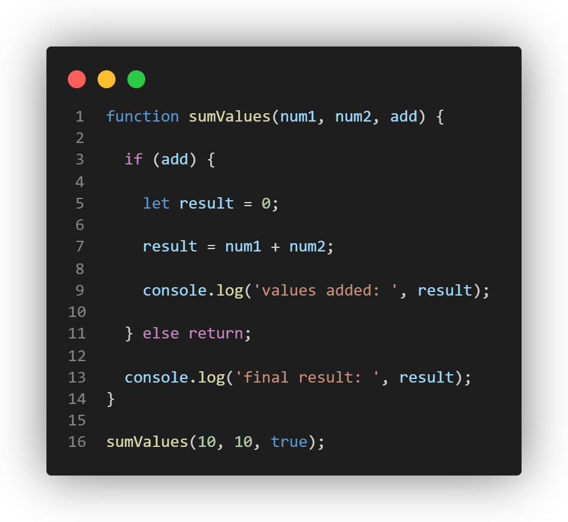
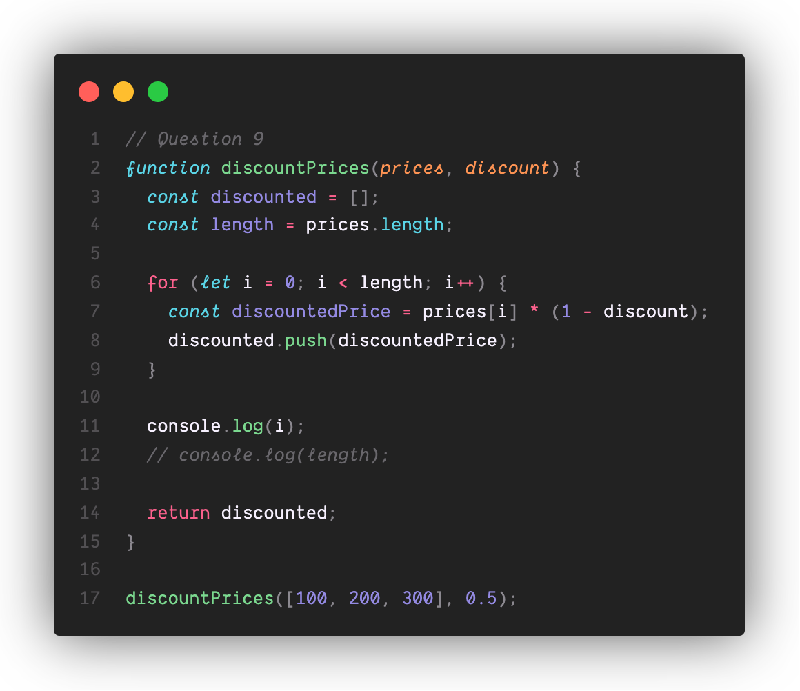
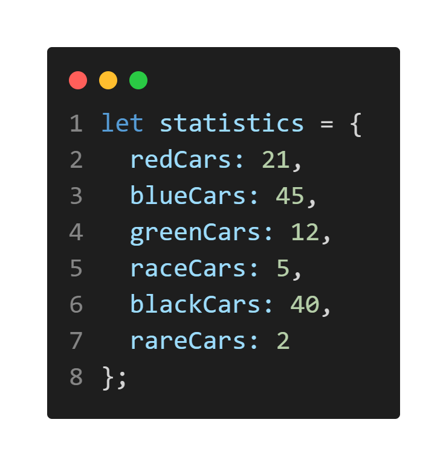
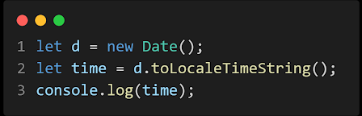

# Lab Week 4 - JS Language Intro, Diagramming and DevTools Part 2

## 1. Expose - 8pts
Since this is CSE 110 we know you have programmed before, so this lab will more-so get you acquainted with how JavaScript is different. At the end of this section we’ll then use our DevTools to learn how to debug a bit.

### Resources

[The Modern JavaScript Tutorial](https://javascript.info/)

[JavaScript | MDN (mozilla.org)](https://developer.mozilla.org/en-US/docs/Web/JavaScript)

## Set Up
* Install Node https://nodejs.org/en/
* Create a new repo named “fa22-cse110-lab4”. Create the following directory structure (note: these are all directories, so expose/javascript is a folder within a folder):
    * expose/javascript
    * expose/devtools
    * explore/devtools (optional)
    * explore/diagramming (optional)
    * expand (optional)
* If you wish to complete the explore section, install the Draw.io VSCode Extension [Draw.io Integration - Visual Studio Marketplace](https://marketplace.visualstudio.com/items?itemName=hediet.vscode-drawio)
* You will store your answers from each part in the corresponding directory.

### Intro to Javascript

#### Instructions: 

Inside the **expose/javascript** directory, create **part1.md** and **part2.md** files inside where you will store your answers for the javascript questions.

If the question has you write any code, unless specified otherwise, create a JavaScript file with the name format **partX-questionY.js**. So for example, if the question was number 14 in part 1 you would have **part1-question14**.js as your filename. You can run and test these js files with Node from your command line by executing the command “node **filename**.js”. Make sure that your answer numbers in your markdown files match our answer numbers as you might skip some if one is a question where you write code.

 
#### Variables & Scoping

Here are some links that will help you understand a bit about JavaScript variable scopes, we highly recommend viewing them before continuing with the lab:

* [Variables (javascript.info)](https://javascript.info/variables)
* [Variable scope, closure (javascript.info)](https://javascript.info/closure) - Only the first bit about Code Blocks
* [The old "var" (javascript.info)](https://javascript.info/var)
 
#### Part 1. A Quick Introduction...

For this section (questions 1-6), observe the effect that the keywords const, let, and var have on the sumValues() function and those differences are caused by their differing variable scopes. 

#### var declaration 

The var keyword provides its variable with what is known as function scope. This means that regardless of the block it is defined in, it can be accessed anywhere inside the function it is defined in. Be careful when using var to declare your variables in your programs, as it may lead to naming conflicts and scoping issues. 

1. What is printed by line 9? If the code returns an error, explain why. ^^^^^
2. What is printed by line 13? If the code returns an error, explain why. 
 
#### let declaration

Declaring a variable with the let keyword provides the variable with what is known as **block scope**. This means that it can only be accessed within the block it is defined in, unlike the var keyword. 

3. What is printed by line 9? If the code returns an error, explain why. ^^^^^

4. What is printed by line 13? If the code returns an error, explain why. 

#### const declaration

The const keyword gives its variable the same scope as the let keyword. Declaring a variable with the const prevents it from being reassigned after it is assigned for the first time, much like the final keyword in Java, making it useful for declaring constants in your programs. 

5. What is printed by line 9? If the code returns an error, explain why. ^^^^^

6. What is printed by line 13? If the code returns an error, explain why. 

#### Part 2. A Little More of a Challenge...

In this next section, use what you understand about the differences between declaring variables with var, let, and const to help you work with a more complicated block of code. 

1. ^^^ What will happen at line 12 and why? If the code causes an error, explain why. ^^^

2. ^^^ What will happen at line 13 and why? If the code causes an error, explain why. ^^^

3. ^^^ What will happen at line 14 and why? If the code causes an error, explain why. ^^^

4. ^^^ What will this function return? Give a brief explanation why. If the code causes an error, explain why. ^^^

5. ^^^ What will happen at line 12 and why?  If the code causes an error, explain why. ^^^ (assume this function is being called like the others: discountPrices([100, 200, 300], 0.5)).

6. ^^^ What will happen at line 13 and why? If the code causes an error, explain why. ^^^

7. ^^^ What will happen at line 14 and why? If the code causes an error, explain why. ^^^
 

8. ^^^ What will this function return? Give a brief explanation. If the code causes an error, explain why. ^^^

9. ^^^ What will happen at line 11 and why? If the code causes an error, explain why. ^^^

10. ^^^ What will happen at line 12 and why? If the code causes an error, explain why. ^^^

11. ^^^ What will this function return? Give a brief explanation. If the code causes an error, explain why. ^^^
 

### Data Types

There are 9 data types in JavaScript. Unlike in other languages, JavaScript lets you assign any data type to any variable at any time, since variables aren’t initialized as a single type. You can read more about the data types here: [JavaScript data types and data structures - JavaScript | MDN (mozilla.org)](https://developer.mozilla.org/en-US/docs/Web/JavaScript/Data_structures)

Primitive data types in JavaScript behave the same as most other languages, the tricky part with them will be conversions and comparisons which we will get to in the next section. Here, we’re going to focus on Objects. If you have seen JSON (JavaScript Object Notation) before, then you are familiar with their format. Here is a link to help you understand JavaScript Objects if you are unfamiliar [Objects (javascript.info)](https://javascript.info/object)

12. Given the above Object, write the notation for:  (These should be in your **part2.md**)

    A. Accessing the value of the name property in the student object

    B. Accessing the value of the Grad Year property in the student object

    C. Calling the function for the greeting property in the student object

    D. Accessing the name property of the object in the Favorite Teacher property in student

    E. Access index zero in the array of the courseLoad property of the student object
 

### Basic Operators & Type Conversion 

For this section make sure you have Node installed on your computer; this will allow you to run JS on your machine outside of a web browser. Next, open up a terminal and execute the command “node” (without quotes). This should bring up the Node.js command line allowing you to execute short bits of JS for a quick answer, which should help in this section.

One of the key parts of JavaScript is its weak typing, meaning that a single variable can take on multiple different data types (i.e. a variable initially declared as a string can legally be reassigned to an integer). Because of this, Javascript is also designed to be able to compute operations between variables of different data types meaning we can do things like adding a string and an int (what?). 

JavaScript is able to do this because it is able to map the value of a variable from one data type to another. For example,

* true + 10 = 11 since true maps to 1
* 3 + ‘5’ = ‘35’ since integers map to their exact string representation
* ‘hi there ’ + {} = ‘hi there [object Object]’ since objects map to the string ‘[object Object]’
* ...and there are many more examples

While this is one of its greatest strengths, it can cause a lot of confusion for developers who don’t fully understand how types are converted. However, what we can rely on is the fact that the conversions between data types are consistent and can be looked up on the internet easily. 

What is important is the understanding that type conversions occur automatically and without warning which can help you identify strange bugs or create helpful shortcuts. Here are some helpful links to get you started with this section:

[Comparisons (javascript.info)](https://javascript.info/comparison)

[Type Conversions (javascript.info)](https://javascript.info/type-conversions)

For each of the following questions, note down the output as well as a brief explanation why that output was given  (These should be in your **part2.md**)

13. Arithmetic

    A. ‘3’ + 2

    B. ‘3’ - 2

    C. 3 + null

    D. ‘3’ + null

    E. true + 3

    F. false + null

    G. '3' + undefined

    H. '3' - undefined

14. Comparison

    A. ‘2’ > 1

    B. ‘2’ < ‘12’

    C. 2 == ‘2’

    D. 2 === ‘2’

    E. true == 2

    F. true === Boolean(2)

15. Explain the difference between the == and === operators.
 
### Loops

Loops in JavaScript are nothing fancy, the format for for, while, and do while being identical to most every programming language (the only difference being the fact you create your iterating variable with a JS keyword, typically let). There is one other JS specific type of loop that can be handy to know, the for...in loop. This will let you iterate over every property inside of an Object (much like the for...in loop used in Python). Here is a link with some information about their syntax and how they operate

[for...in - JavaScript | MDN (mozilla.org)](https://developer.mozilla.org/en-US/docs/Web/JavaScript/Reference/Statements/for...in)

16. Given the above Object, write a for...in loop that will iterate through it and print out the value of the property if the property starts with the letter r, or if the value of that property is an odd number.  (This should be in a JS file part2-question16.js)
 
### Functions

Like most programming languages, JavaScript has functions, simply written with the keyword “function”. As seen above in the Data Types section, a function is also 1 of the 9 data types and can thus be stored in a variable and easily passed around like any other variable. Since functions can be stored in a variable, we can call the function using that variable at a later time in your program. 

This allows for one to return a function as a value, allowing these functions to be “called back to” at a later time (which can help if things are happening asynchronously, such as if you are awaiting a response from a server).

[Introduction: callbacks (javascript.info)](https://javascript.info/callbacks)

[Callback Functions (javascript.info)](https://javascript.info/function-expressions#callback-functions)

17. If the function above is called with the following parameters **modifyArray([1,2,3], doSomething)**, what will be the result? Briefly walk through how you arrived at that result. (This should be in your **part2.md**). Here we are passing in a function as a parameter, however we can also return a function from another function just as easily, you're encouraged to play around with callbacks as they are used heavily in frontend JS development. 
 
### setInterval(), setTimeout(), clearTimeout()

Since a lot of JavaScript will be running in real time while the user is on a webpage, you’ll probably run into situations where you need some code to execute at consistent intervals, or once after a set period of time. That’s where setTimeout(), setInterval(), and clearTimeout() come into play. Here are some links to show you how they operate:

* [MDN: setTimeOut](https://developer.mozilla.org/en-US/docs/Web/API/setTimeout)
* [MDN: setInterval](https://developer.mozilla.org/en-US/docs/Web/API/setInterval)
* [MDN: clearTimeout](https://developer.mozilla.org/en-US/docs/Web/API/clearTimeout)

18. The above program only prints out the time once when executed. Modify this code such that the program prints out the time every second.  (This should be a JS file - **part2-question18.js**)
 

19. What is the output of the above code? (This should be in your **part2.md**)
 

### Basic DevTools
#### Instructions: 

Inside the **expose/devtools** directory, create a **devtools-pt1.md** file inside where you will store your answers for part 3 questions.

Lab 4 DevTools site: https://cse110-fa22.github.io/Lab4_Hosted/

#### DevTools - Network Tab

To wrap up the **expose** section we’re going to take a peek into the network tab a bit, and see what all the graphs and text and headers are about.

Your first step will be to open your DevTools and navigate to the Network tab. Once that’s open, click the “Fetch Data” button on the webpage and observe your Network tab for the new json file that will appear.

Once it finishes downloading, answer the following questions:

1. What is the name of the new json file?

2. Which file initiated the download of the new file?

3. What is its file size?

4. How long did it take to download?

 

Next, select that file to bring up a new side panel to answer the following:

5. What was your User-Agent for the browser that made the request?

6. In the response header, what type of server did it come from?

7. When was the file last modified?

8. What was the Content-Type of the file?

Navigate to the Initiator tab now and answer the last question

9. Which function inside the initiating file made the request?

 

## 2. Explore - 2pts

NOTE: To begin this section, you MUST have completed the previous "Expose" section

### DevTools - Debugging
Here is a link on how to use the debugging features in Google Chrome

[Javascript Debugging in Chrome (javascript.info)](https://javascript.info/debugging-chrome)

Inside the **explore/devtools** directory, create a **devtools-pt2.md** file inside where you will store your answers for part 3 questions.

[The Lab 4 DevTools site](https://cse110-fa22.github.io/Lab4_Hosted/) contains a simple program that calculates the sum of two input numbers. However, the program is not functioning as expected. You will be using the Chrome DevTools to debug the Javascript code to fix this program.

Note: Do not debug using console.log(). Practice using the Debugging tool in the Chrome DevTools for this exercise.

During your debugging process, include the following screenshots:

* When the debugger is triggered, set a breakpoint at the initialization of the local variable result in calculateSum(). Take a screenshot of the list of breakpoints containing the breakpoint you just added. Name it result-calculateSum.png (or whatever image extension you would like to use)
* Add watch expressions to find the value of num1 and num2, and the data type of result. Take a screenshot of the watch expressions list. Name it result-dataType.png (or whatever image extension you would like to use)

Answer the following questions:

1. What was the bug?
2. How would you fix it? Include a screenshot of your fix. Name it **fix.png** (or whatever image extension you would like to use)
 

### Diagramming
When creating any website or app, it is imperative to go in with a roadmap to not only save time, but a lot of headache down the line. Having a master diagram for various parts of your website / app also has the added benefit of keeping everyone in your group on the same page. For this part of the lab you will be taking a look at creating a flowchart for a simple website I will describe below.

Although the term flowchart gets thrown around a lot, there are conventions that one should follow when making one. Specific symbols that mean specific things. You can read about the basics of flowcharts here [Flowchart Tutorial (with Symbols, Guide and Examples) (visual-paradigm.com)](https://www.visual-paradigm.com/tutorials/flowchart-tutorial/)

Inside the **explore/diagramming** directory, create a file named **diagram.drawio.png** from inside of VSCode. If you have installed the draw.io extension correctly, this should open up a diagram editor as seen here [demo.gif](https://raw.githubusercontent.com/hediet/vscode-drawio/master/docs/demo.gif) (The demo uses .drawio but **please use .drawio.png**)

Now in this file simply make a flowchart for the website (a very simplified retail web shop) described below:

* The user begins by entering the website
* The user then has the option of either searching for a product or exploring the products on the home page
    * If they search for a product, they will provide input to the website of their search
* In both cases, the user will then begin looking over the products
* The user is then faced with the option of viewing a specific product
    * Both options will lead to them deciding whether to continue shopping, but if they add it to their cart they will receive an added to cart confirmation first
    * They will then have the option to add this item to their cart
    * If they choose to view a specific product, that product’s webpage will open
    * If they don’t choose to view the item, they will be faced with the decision to continue shopping
* If the user decides to continue shopping, they will again be faced with the choice of searching for a new product or not
* If they decide to not continue shopping, they will have to decide whether or not to checkout.
    * If they don’t check out, they leave the website
* If they do decide to check out, they will reach the View Cart screen
* From the View Cart screen they will go to the View Payment screen
* From the View Payment screen they will give input of their payment information
* After they’ve paid, they will see an order confirmation screen and at the same time will receive an email

After the order confirmation screen the user will leave the website

 

## 3. Expand - No Points, No Extra Credit

NOTE: To begin this section, you MUST have completed the previous "Expose" and "Expand" sections

The following are a series of free response questions. If you complete this section, please complete every question, and please leave full, thought out responses. All of these questions should be **in your own words**. Put your answers in **expand.md** inside the **expand** directory

1. Some JavaScript developers believe that most of the issues with JavaScript stem from its asynchronous nature, its loose typing, and the web platform it runs on. For each of the three reasons listed, explain in your own words why a developer might believe that it is a pain point.
2. Related to the first question, why do you believe that the developer(s) who created JavaScript made it loosely typed? Why do you think they added asynchronous features?
3. What are the key differences between a compiled language and an interpreted one? Which one is JavaScript? What are the benefits & drawbacks of JavaScript being made that way?
4. The professor believes that, though sometimes misused, JavaScript frameworks are incredibly powerful tools that can help teams work more efficiently and effectively. Given that, why do you believe he is focusing more on vanilla JavaScript for this course? What are the benefits of mastering vanilla JS first? What are the drawbacks of not learning a framework?
5. Explain, in your own words, how you think this lab relates to your project. How might you be able to use this information in your own project?
 

## Canvas Submission:
* Link to your repo containing:
    * expose directory
        * javascript subdirectory
            * part1.md
            * part2.md
            * any .js files
        * devtools subdirectory
            * devtools-pt1.md
    * explore directory
        * devtools subdirectory
            * devtools-pt2.md
            * any screenshots you took
        * diagramming subdirectory
            * diagram.drawio.png
    * expand directory
        * expand.md
        * All screenshots
